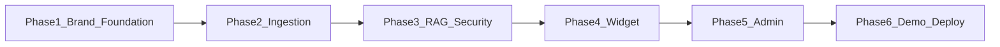

# Groundly — 6 Build Phases

Master schedule for the Fiverr / portfolio build. Full product spec: [ai-support-agent-platform-docs.md](../ai-support-agent-platform-docs.md). Design & logo: [design-system.md](../design-system.md).

**Framing:** White-label codebase + live Riverside Dental demo — not a Stripe SaaS.

| Phase | Name | Days (part-time) | Outcome |
|---|---|---|---|
| [1](phase-01-foundation-brand.md) | Foundation & brand | 2–3 | Design system, logo in repo, Docker, schema, auth, health |
| [2](phase-02-ingestion.md) | Document ingestion | 2 | PDF/FAQ → chunk → embed → status in DB |
| [3](phase-03-rag-security.md) | Hybrid RAG & security | 2–3 | Grounded SSE chat, citations, fallback, origin + rate limits |
| [4](phase-04-widget.md) | Embeddable widget | 1–2 | Shadow DOM widget buyers see in Loom |
| [5](phase-05-admin-dashboard.md) | Admin dashboard | 2–3 | Docs, conversations, leads, settings — designed UI |
| [6](phase-06-demo-deploy.md) | Demo, eval & launch | 1–2 | Seed, golden eval, live demo, Fiverr assets |

**MVP cut line:** finish Phases **1–5** + Phase 6 deploy/seed (skip crawler/deep analytics if short).  
**Total:** ~12–17 days part-time.

**Design mandate (every UI phase):** follow [design-system.md](../design-system.md) — teal/ink brand, Fraunces + Plus Jakarta Sans (or chosen pair), no generic purple SaaS look, logo in header/widget launcher.
